# EduMatch Tutoring Platform

> A full-featured **tutor-student matching platform** designed for **students, tutors, and administrators**.

> The system provides:
>
> - A **learning experience for students** with tutor discovery, booking requests, schedule negotiation, deposit payment, classes, reviews, and chat.
> - A **workspace for tutors** to manage profiles, applications, learning requests, classes, schedules, notifications, and student communication.
> - An **admin dashboard** to manage users, subjects, tutors, classes, payments, deposit policies, cancellation requests, and platform activity.
> - An integrated **tutor recommendation service** that ranks tutors by learning needs, subjects, grade level, and profile similarity.
>
> This project was built for **learning and internship applications**, aiming to simulate a **real-world tutoring marketplace workflow** and demonstrate how frontend, backend, realtime communication, payments, file upload, and recommendation services work together in practice.

---

## Demo

> Some images of the public and student website:

<p align="center">
  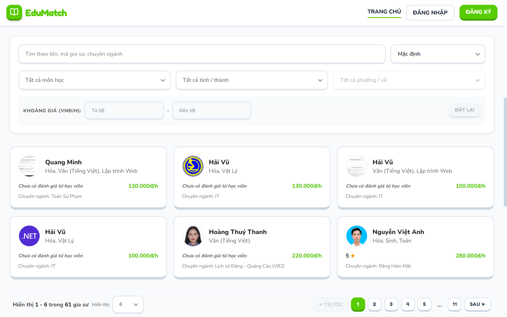
  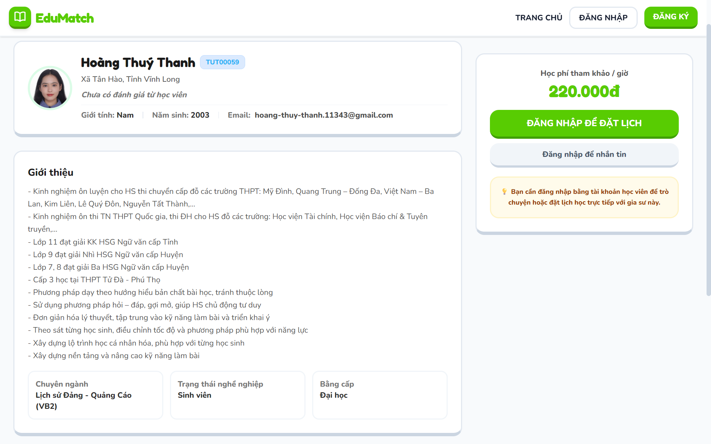
  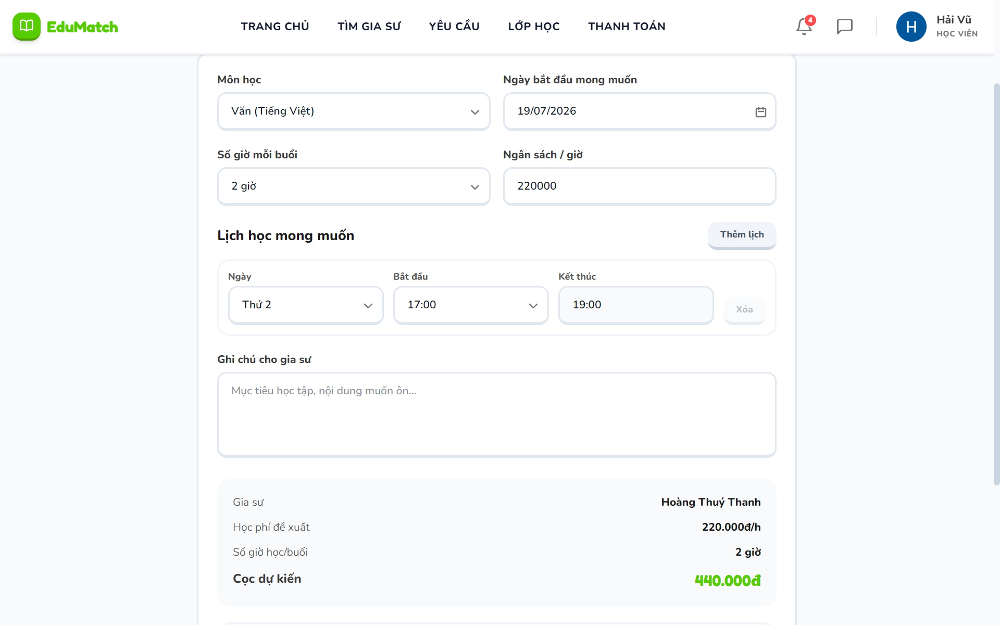
  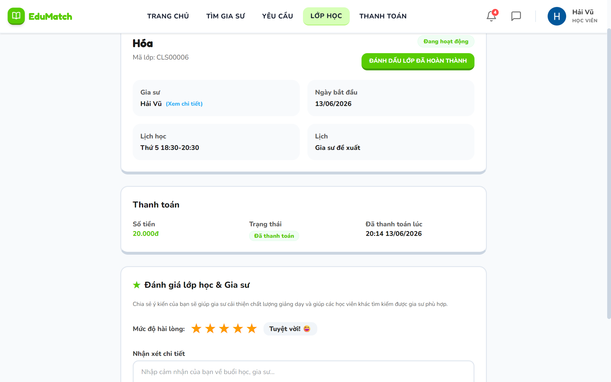
</p>

> Some images of the tutor and admin workspace:

<p align="center">
  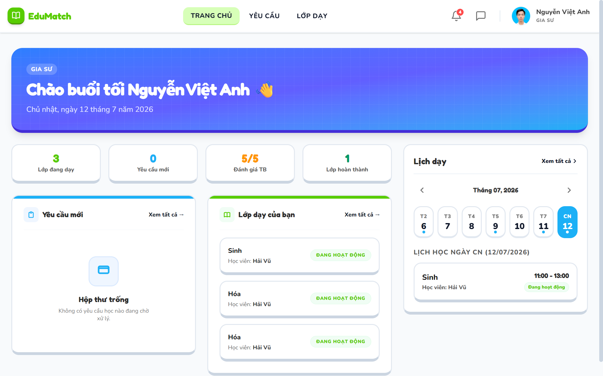
  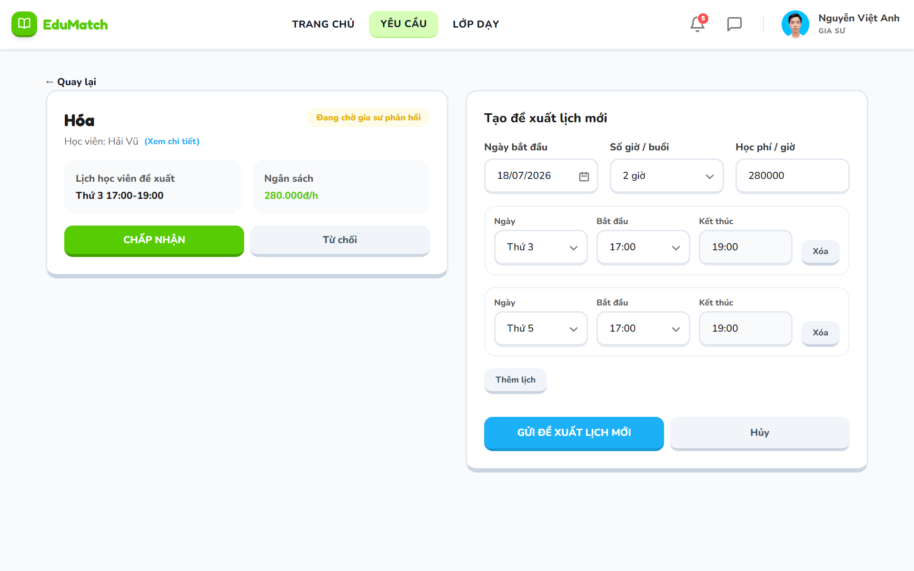
  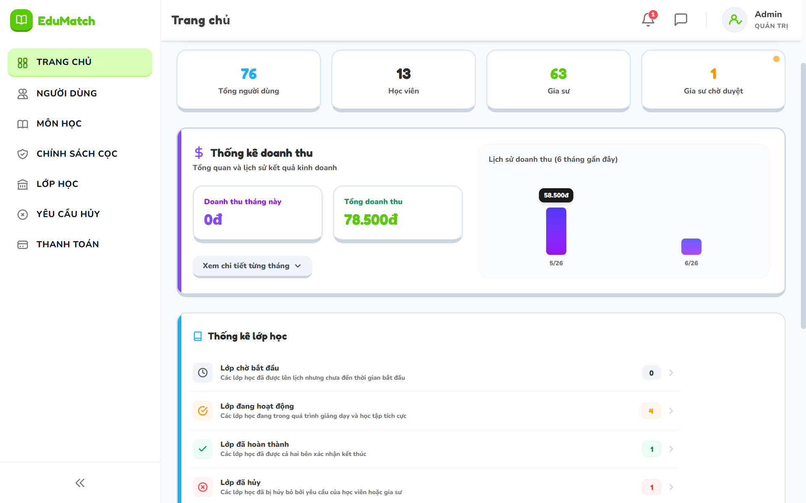
  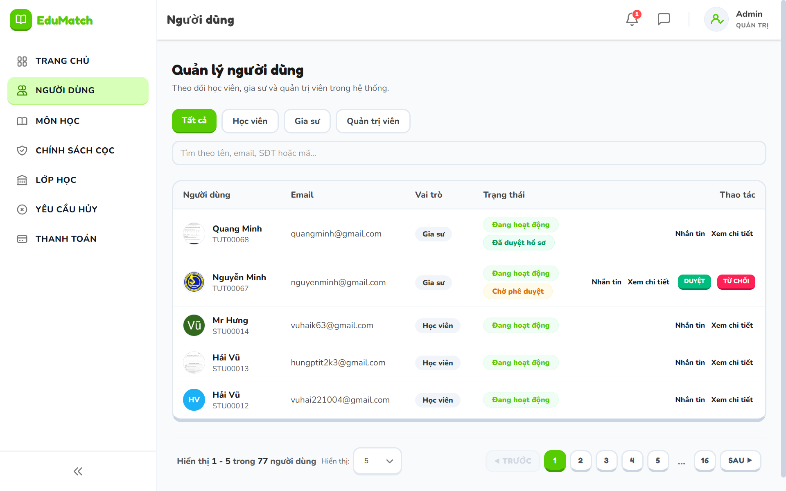
  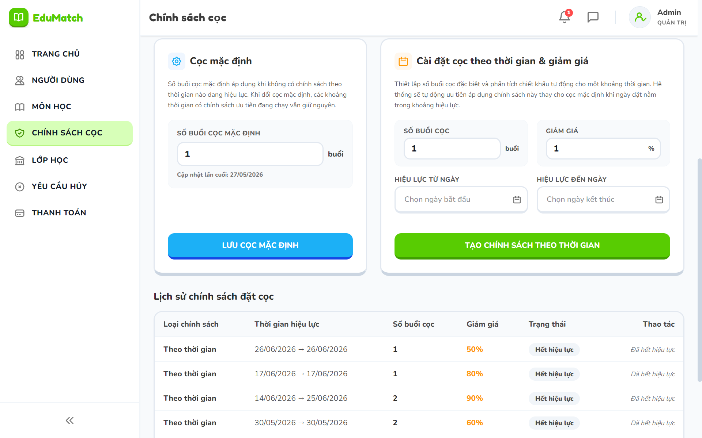
</p>

> System and integration overview:

<p align="center">
  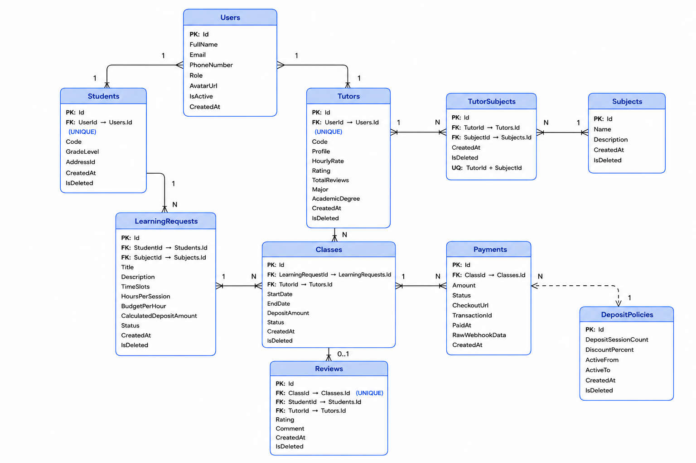
  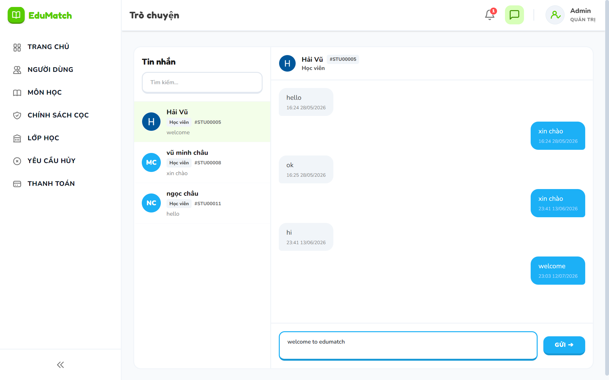
  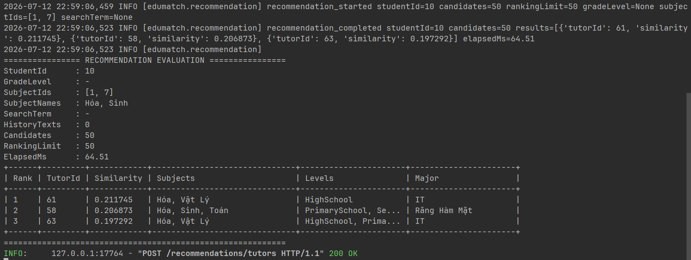
</p>

---

## Main Features

- **User Roles & Access Control**  
  Supports STUDENT, TUTOR, and ADMIN roles with protected routes and role-based API authorization.

- **Authentication & Account Recovery**  
  Supports registration, login, Google login, JWT authentication, refresh tokens, forgot password, reset password, and BCrypt password hashing.

- **Tutor Discovery & Booking**  
  Students can search tutors, view tutor profiles, create learning requests, propose schedules, and track request status.

- **Tutor Applications & Schedule Negotiation**  
  Tutors can apply to student tutor requests, respond to learning requests, and negotiate schedules before a class is created.

- **Deposit Payment Integration**  
  Deposit payment is handled via **PayOS**, including payment creation, webhook validation, payment status sync, and post-payment class creation.

- **Class Lifecycle Management**  
  Students, tutors, and admins can follow classes through pending, active, completed, cancellation, and completion-confirmation flows.

- **Real-time Chat & Notifications**  
  Built-in chat and notifications use **SignalR** for realtime communication between students, tutors, and admins.

- **File Uploads**  
  Avatar and tutor CV uploads are integrated with **Cloudinary**, including validation and signed file access.

- **Tutor Recommendation Service**  
  A separate **FastAPI** service ranks tutors using TF-IDF and cosine similarity, with backend fallback ranking if the service is unavailable.

---

## Technology Used

| Client / UI    | Backend API                    | Other Services                 |
| -------------- | ------------------------------ | ------------------------------ |
| Angular 21     | ASP.NET Core Web API (.NET 10) | PostgreSQL                     |
| Tailwind CSS 4 | Entity Framework Core          | PayOS (Payment)                |
| TypeScript     | JWT / Refresh Token Auth       | Cloudinary (File Storage)      |
| RxJS           | SignalR                        | MailKit / SMTP Email           |
| Lucide Angular | Swagger / Swashbuckle          | Google Login                   |
| ng-openapi     | Hosted Background Services     | FastAPI Recommendation Service |
| Vitest         | AutoMapper                     | provinces.open-api.vn          |

---

## Installation

### Required

- .NET SDK 10
- PostgreSQL
- Node.js 18+ and npm
- Python 3.10+

### 1. Clone repository

```bash
git clone https://github.com/vuhai2710/edu-match.git
cd edu-match
```

### 2. Configure backend

Update `backend/EduMatch/appsettings.json` or provide environment variables for:

```json
{
  "ConnectionStrings": {
    "DefaultConnection": "Host=localhost;Port=5432;Database=db_name;Username=postgres;Password=your_password"
  },
  "Jwt": {
    "Key": "your_jwt_secret_key",
    "Issuer": "EduMatchAPI",
    "Audience": "EduMatchClient"
  },
  "Frontend": {
    "BaseUrl": ""
  },
  "Recommendation": {
    "BaseUrl": ""
  }
}
```

Optional integrations:

- `GoogleAuth:ClientId`
- `Cloudinary:CloudName`, `Cloudinary:ApiKey`, `Cloudinary:ApiSecret`
- `Email:Host`, `Email:Port`, `Email:Username`, `Email:Password`
- `PayOS:ClientId`, `PayOS:ApiKey`, `PayOS:ChecksumKey`, `PayOS:ReturnUrl`, `PayOS:CancelUrl`

### 3. Run backend

```bash
cd backend/EduMatch
dotnet restore
dotnet run
```

The backend applies EF Core migrations and seed data on startup.

### 4. Run recommendation service

```bash
cd backend/recommendation_service
python -m venv .venv
.venv\Scripts\activate
pip install -r requirements.txt
uvicorn app.main:app --reload --host ___ --port ___
```

### 5. Run frontend

```bash
cd frontend
npm install
npm start
```

---

## Useful Commands

```bash
# Backend build
dotnet build backend/EduMatch/EduMatch.csproj

# Frontend build
cd frontend
npm run build

# Generate Angular API client from Swagger
cd frontend
npm run api:generate
```

---

## Project Structure

```text
edu-match/
  backend/
    EduMatch/                  # ASP.NET Core Web API
      Controllers/             # REST endpoints
      Services/                # Business logic
      Repositories/            # Data access
      Data/                    # DbContext, configurations, seed data
      Domain/Booking/          # Booking, scheduling, deposit logic
      Models/                  # EF Core entities
      DTOs/                    # Request/response contracts
      Configurations/          # SignalR hubs, background jobs, settings
    recommendation_service/    # FastAPI tutor recommendation service
  frontend/                    # Angular client app
    src/app/features/          # Public, auth, student, tutor, admin screens
    src/app/api/               # Generated API client and facades
    src/app/core/              # Auth, guards, HTTP, realtime
    src/app/shared/            # Shared UI components and layouts
```
